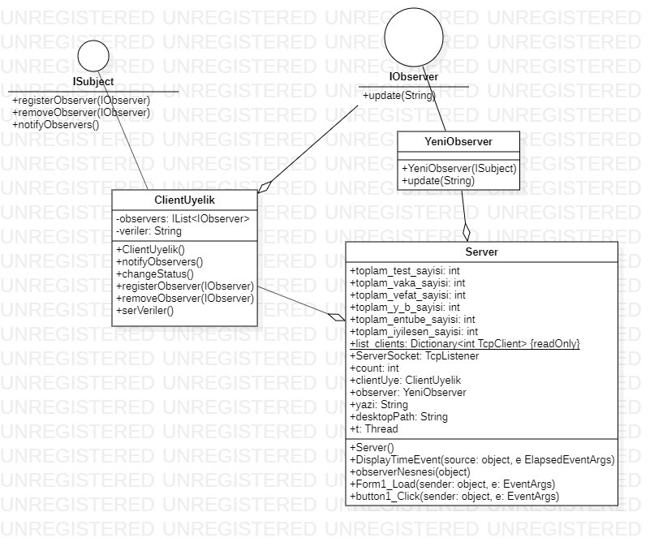
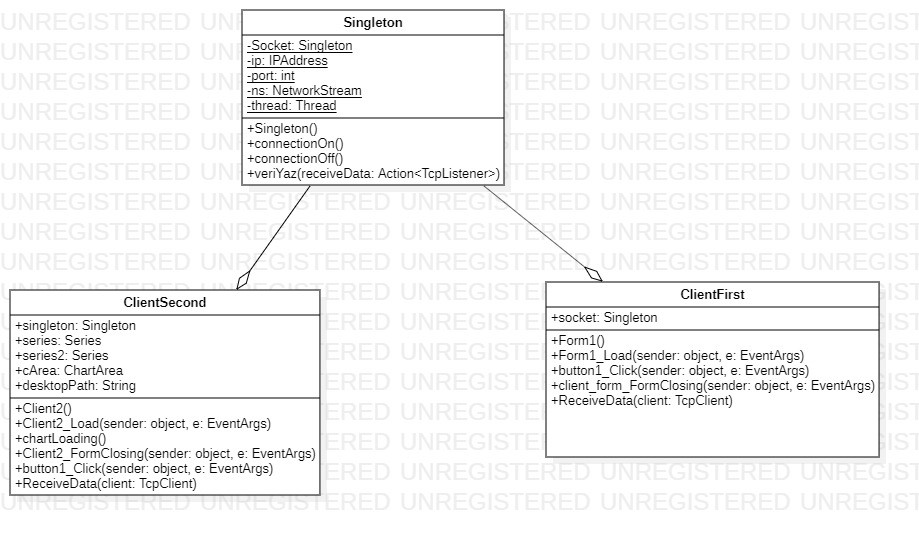

# Turkey Covid-19 Chart Clone

Her gün yayınlanan Türkiye Genel Covid-19 Tablosu'nun C# ile tasarlanmış klonu.

### Server

  - Günlük test, vaka, yoğun bakımdaki hasta sayısı, entübe hasta sayısı, ölü sayısı ve iyileşen hasta sayıları tarih bilgisi ile birlikte girilmektedir. 
  - Observer Design Pattern kullanılmıştır.
  
>

### Client

  - Server programına TCP Soketleri ile bağlanılarak anlık verileri dinleyebilmektedir. Güncellenen veriler dosya olarak kaydedilmektedir.  
  - Singleton Design Pattern kullanılmıştır.

>
